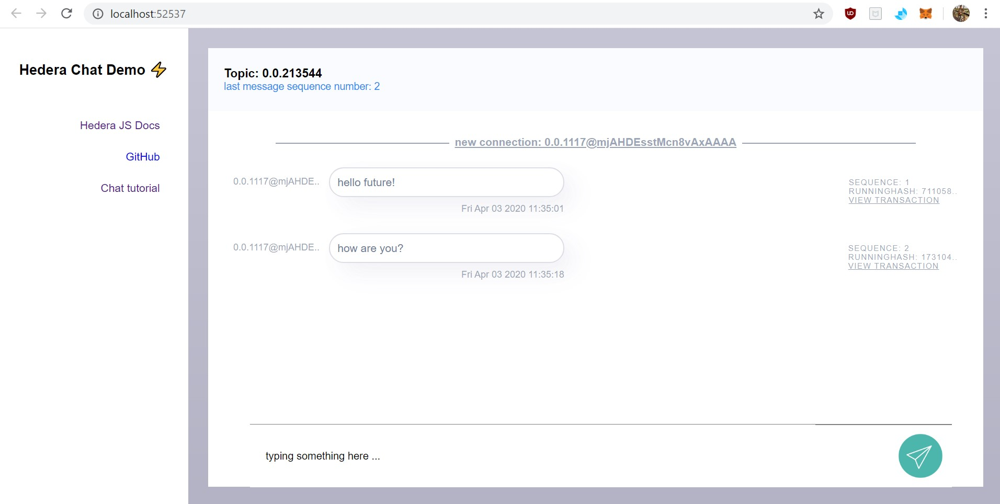
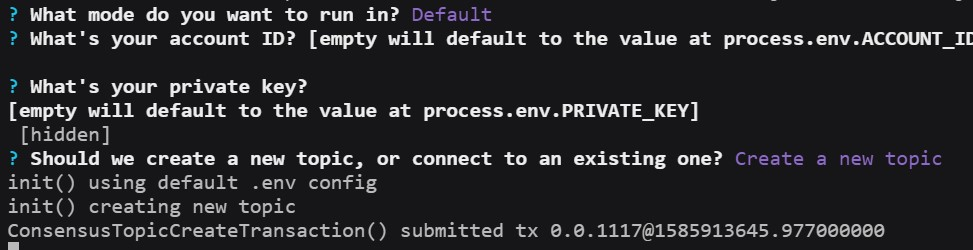

# Hedera Consensus Service Chat Tutorial

An example web app which demonstrates how you can use decentralized pub-sub messaging on the Hedera Consensus Service.



> Estimated set up is ~10 minutes. If it takes you longer or issues arise, please [reach out](https://github.com/hashgraph/hedera-hcs-chat-js/issues)!

### Built With

- [Hedera Hashgraph](https://www.hedera.com/) - The enterprise grade public network
- [Hedera Hashgraph's JavaScript SDK](https://github.com/hashgraph/hedera-sdk-js) - The easiest way to use Hedera in JavaScript
- [Express.js](https://expressjs.com/) - A fast, unopinionated web framework for node.js
- [Socket.io](https://socket.io/) - A realtime client to server framework for node.js

### Contributors & maintainers

I'd love your help supporting, growing, and improving this application. Seriously!

If you have any ideas please [get in touch](https://twitter.com/cooper_kunz) or file a [pull request](https://github.com/hashgraph/hedera-hcs-chat-js/pulls).

### Prerequisites

This demo assumes that you have an account on the Hedera Testnet. For example:

```
ACCOUNT_ID=0.0.123456789
PRIVATE_KEY=302e020100300506032b657004220420f4361ec73dc43e568f1620a7b7ecb7330790b8a1c7620f1ce353aa1de4f0eaa6
```

If you don't have one yet, sign up at [portal.hedera.com](https://portal.hedera.com/).

## Getting Started

You can clone this repository by running the following command:

```
git clone https://github.com/hashgraph/hedera-hcs-chat-js.git
```

Copy the `.env.sample` file and rename the copy to `.env`

Then update the newly renamed `.env` file with your Hedera Testnet account info as indicated. For example:

```
ACCOUNT_ID=0.0.123456789
PRIVATE_KEY=302e020100300506032b657004220420f4361ec73dc43e568f1620a7b7ecb7330790b8a1c7620f1ce353aa1de4f0eaa6
TOPIC_ID=0.0.28583
```
The `TOPIC_ID` is used when connecting to an existing topic. If you don't have one, you can leave it as is.

After downloading and setting up our environment, we'll install our packages via [npm](https://docs.npmjs.com/about-npm/).

```
npm install
```

If installing the dependencies was succesful, now try to run the server!

```
node server.js
```

After running your server, it will prompt you to configure your chat, e.g.

```
1. What mode do you want to run in?  <--- "Default", "Minimal", "Debug"
2. What's your account ID?           <---  defaults to the .env schema
3. What's your private key?          <---  defaults to the .env schema
4. Should we create a new HCS topic, or connect to an existing one?
```

If everything was configured properly, the chat should now open at a random port location.

You can additionally run another instance of the chat application by creating a new terminal, and running the application again. This will find another unused, random port location, and deploy multiple instances to your local machine. With the environment configurability, you can test out multi-client chats.

### Disclaimer

This is just a simple demo application. Please use responsibly.

[Contact me](https://twitter.com/cooper_kunz) if you need anything, or [file an issue](/issues) if you see problems.

### LICENSE

[Apache 2.0](LICENSE)
